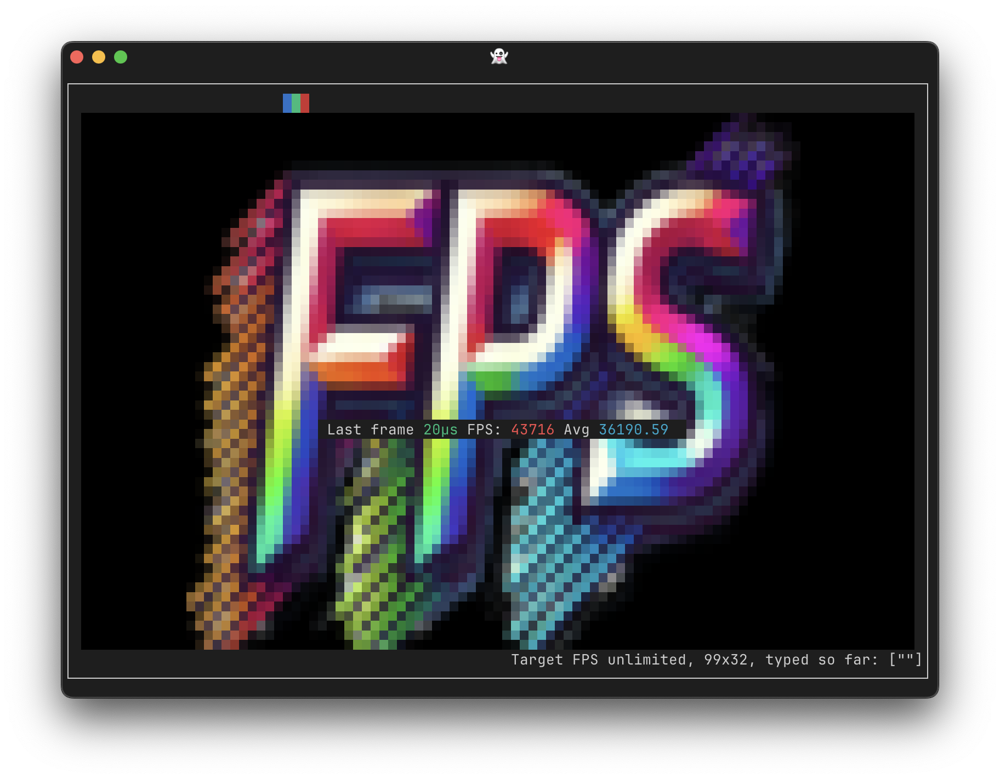
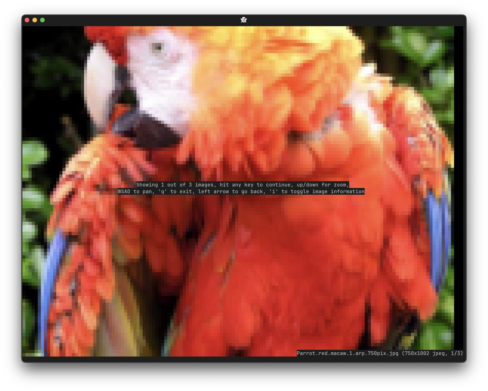
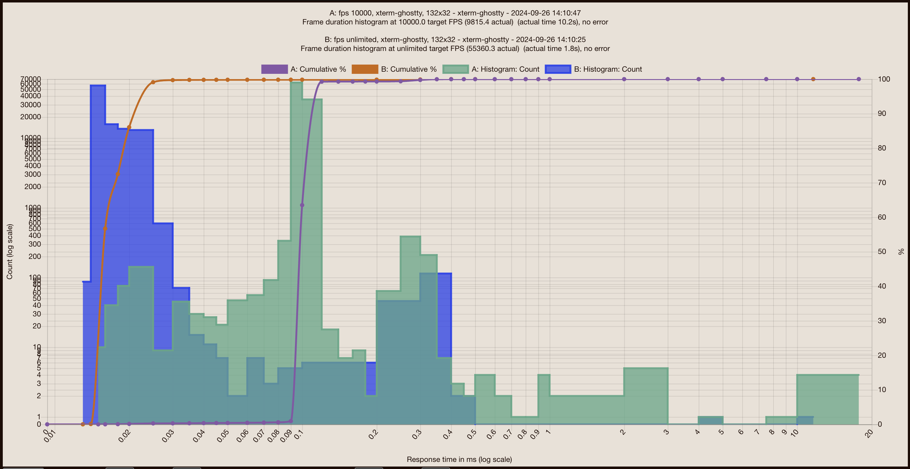

# FPS

The tagged release of [fortio.org/terminal/ansipixels](https://pkg.go.dev/fortio.org/terminal/ansipixels) used to also includes this standalone binary, `fps`, which tests your terminal frames per second capabilities.

> Note:
> FPS used to be just a directory in [fortio/terminal](https://github.com/fortio/termina/) but had to be broken away
> to avoid a loop with its use of fortio for stats, and unfortunately the otherwise excellent goreleaser non pro doesn't let
> you just have a sub go.mod, so I moved it here while preserving the old path thanks to fortio.org meta tags

See the source [fps.go](fps.go)

You can get the binary from [releases](https://github.com/fortio/fps/releases)

Or just run
```
CGO_ENABLED=0 go install fortio.org/terminal/fps@latest  # to install or just
CGO_ENABLED=0 go run fortio.org/terminal/fps@latest  # to run without install
```

or even
```
docker run -ti fortio/fps # but that's obviously slower
```

or
```
brew install fortio/tap/fps
```

Use the `-image` flag to pass a different image to load as background. Or use `-i` and fps is now just a terminal image viewer (in addition to keys, you can now zoom using the mousewheel, click to move the image - see `?` for help).

Pass an optional `maxfps` as argument.

E.g `fps -image my.jpg 60` will run at 60 fps with `my.jpg` as background.

After hitting any key to start the measurement, you can also resize the window at any time and fps will render with the new size.
Use `q` to stop.



Image viewer screenshot:



Detailed statistics are saved in a JSON files and can be visualized or compared by running [fortio report](https://github.com/fortio/fortio#installation)



Hot (!) off the press a new `-fire` mode for fps (with space to toggle on/off and `i` to turn off the text):


### Web serving fire mode

There is also now a web mode, using `-http :3000` for instance, serves the doom fire mode on /fire on that port, eg

```bash
fps -n 100 -http :3000 20 # 20 fps, 100 frames served
curl localhost:3000/fire  # or add ?colors=256 if the terminal doesn't support truecolor
```

### Usage

Additional flags/command help:
```
fps 0.27.0 usage:
        fps [flags] [maxfps] or fps -i imagefiles...
or 1 of the special arguments
        fps {help|envhelp|version|buildinfo}
flags:
  -color
        If your terminal supports color, this will load image in (216) colors instead of
        monochrome (default true)
  -fire
        Show fire animation instead of RGB around the image
  -gray
        Convert the image to grayscale
  -http port
        Listen port, eg :3000, empty for normal CLI interactive mode
  -i    Arguments are now images files to show, no FPS test (hit any key to continue)
  -image string
        Image file to display in monochrome in the background instead of the default one
  -n number of frames
        Start immediately an FPS test with the specified number of frames (default is
        interactive)
  -nobox
        Don't draw the box around the image, make the image full screen instead of 1
        pixel less on all sides
  -nojson
        Don't output json file with results that otherwise get produced and can be
        visualized with fortio report
  -nomouse
        Disable mouse tracking
  -truecolor
        If your terminal supports truecolor, this will load image in truecolor (24bits)
        instead of monochrome
```
